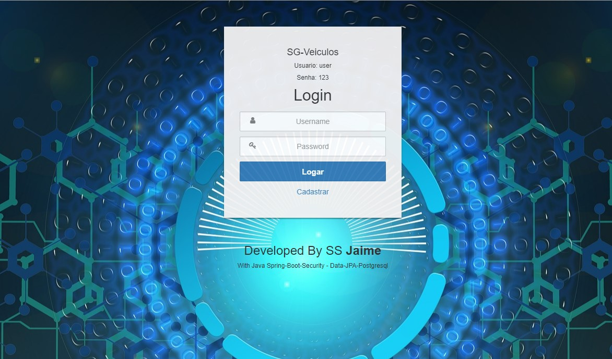
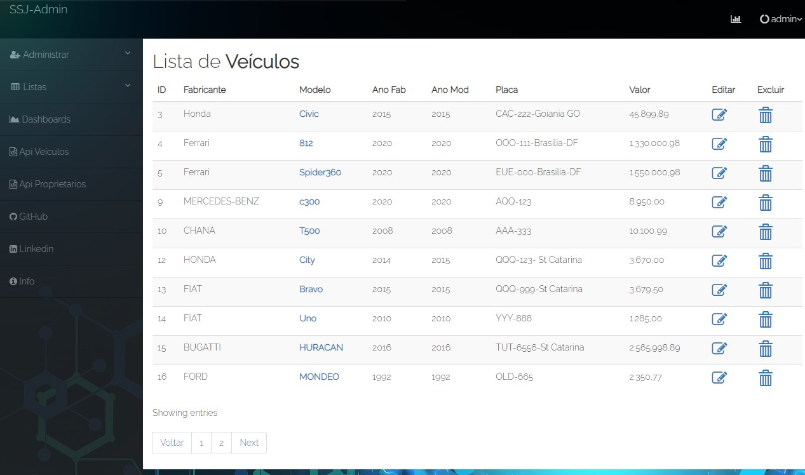

# SG-VEICULOS

## SG-Veiculos

 
<a href="https://app-sgveiculos.herokuapp.com/">
https://app-sgveiculos.herokuapp.com</a>

##

##

# Tecnologias Usadas:

## Backend

* Java 8
* Spring Boot
* Spring Security
* Spring Data-JPA
* BD PostgreSQL

## FrontEnd

* Html
* Css
* Bootstrap
* Template Engine Thymeleaf

##
Projeto de Gestão de veículos e proprietarios com operações de Busca, Cadastro Atualização e Exclusão de Dados.
Disponibilizando uma Api Rest para integração com outros sistemas e tambem por qualquer aplicação frontend.

## Status: Prototipo Inicial
